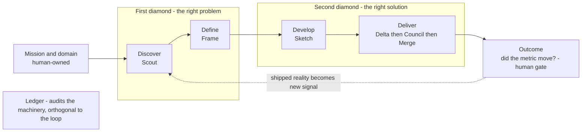

# Double-Diamond Architecture for the deltado Product Engine

**Date:** 2026-05-24
**Status:** Draft for discussion — no implementation committed
**Scope:** Architecture of the missing double-diamond stages, as modular single-function
agents that compose into one repo.

> This is a thinking document, not an implementation plan. It captures the architecture
> discussion of 2026-05-24. Decisions still open are listed at the end.

---

## 1. Context — current state of deltado

deltado is a Next.js test-bed that hosts autonomous agents installed as git submodules.
Four agents are live today:

| Agent | Submodule | One job |
|---|---|---|
| Delta | `delta/` | Product agent picks a feature + writes a brief; Developer agent builds it with TDD; opens a PR. Runs nightly at 02:00 UTC. |
| Council | `council/` | Advisor library; the CTO advisor auto-reviews every Delta PR. |
| Merge | `merge/` | Polls every 30 min for `merge/ready` PRs; after a 24h window runs an AI safety check, then squash-merges or blocks. |
| Ledger | `ledger/` | Daily at 08:00 UTC, checks five deterministic rules and opens a `ledger/gap` issue when the pipeline diverged. |

The accountability loop today is **Delta builds → Council reviews → Merge ships → Ledger audits.**

Coordination is GitHub-native: state files under `.delta/`, PR labels as a state machine,
GitHub issues as the human inbox, and GitHub Actions cron as the runtime. Every agent is
stateless — it reads files and the GitHub API, does its job, and writes back.

---

## 2. The gap — mapping onto the double diamond

The Design Council double diamond has four stages across two diamonds:

- **Diamond 1 — the right problem:** Discover (diverge) → Define (converge)
- **Diamond 2 — the right solution:** Develop (diverge) → Deliver (converge)

Run continuously, it is a **loop**, not a line: Deliver puts a live product into the
world, the product emits signal, and signal re-enters Discover.

Mapping today's agents onto it:

| Stage | Covered today? | Notes |
|---|---|---|
| Discover | Absent | Nobody gathers user, market, or usage signal. Delta's Product agent generates ideas *from imagination* ("from the vision"), not from evidence. |
| Define | Thin | Delta's Product agent writes `BRIEF.md`, but it ranks imagined ideas — there is no evidence-based problem framing. |
| Develop | Collapsed | The pipeline jumps straight from one brief to one implementation. No solution alternatives, no exploration. |
| Deliver | Strong | Delta builds, Council reviews, Merge ships, Ledger audits. This is the mature part. |
| Loop-back | Absent | Nothing measures whether a shipped feature actually worked. Ledger audits the *machine*, never the *product*. |

**The structural gap:** deltado is a Deliver engine with a thin Define cap. The entire
first diamond is missing, the divergent half of the second diamond is collapsed, and the
loop never closes.

---

## 3. Proposed architecture — bend the pipeline into a loop



### 3.1 Agent roster

Drawing the "do one thing" line at **one transformation between two adjacent states of
the loop** yields ~8 agents — four new, four existing:

| Loop stage | Agent | Its one job | Status |
|---|---|---|---|
| Mission | — (human artifact) | Domain, mission, success metrics | Human-owned |
| Discover | **Scout** | World → structured signal corpus | New |
| Define | **Frame** | Signal → ranked problem briefs (hypothesis + metric) | New |
| Develop | **Sketch** | Problem brief → 2–4 solution options → chosen build spec | New |
| Deliver · build | Delta | Build spec → tested code | Exists |
| Deliver · gate | Council | Code → quality judgement | Exists |
| Deliver · ship | Merge | Approved PR → shipped to main | Exists |
| Loop-back | **Outcome** | Shipped feature → did its metric move? | New |
| (orthogonal) | Ledger | Pipeline machinery → gap audit | Exists |

Agent names are placeholders.

### 3.2 Delta should split

Delta currently bundles a **Product agent** — which does idea-generation *and*
problem-definition — with an unrelated **Developer agent**. That is three jobs in one
submodule, a do-one-thing violation. The clean version: Delta becomes *only* the build
agent (spec → tested code), and the Product agent's responsibilities dissolve into
Scout + Frame + Sketch.

### 3.3 Where the "do one thing" line sits

One agent = one transformation, **not** one data source. Scout gathering analytics,
qualitative feedback, and competitor moves are *adapters inside Scout*, not three agents.
Drawing the line at the data source produces thirty agents and unmanageable sprawl.

---

## 4. Coordination substrate — add a schema, not infrastructure

The current substrate (`.delta/` files + PR labels + issues + Actions cron) is elegant:
everything lives in git, so it is versioned, diffable, and hand-editable, and every agent
is stateless. The first diamond breaks it in three specific ways:

1. **Artifact shape.** Discover produces a *corpus* — many evidence items, continuously
   updated — which does not fit a single `BRIEF.md`.
2. **State-machine size.** The loop grows from ~4 states to ~10, and most new states
   occur *before any PR exists*, so PR labels cannot carry them.
3. **Provenance.** Gating outcomes requires tracing a shipped PR back through
   spec → problem → evidence. Loose files do not thread that.

### 4.1 Recommendation

Keep the philosophy, extend the vocabulary. Promote `.delta/` to a repo-level, schema'd
**state directory** (working name `.engine/`) — one contract every agent reads and writes:

```
.engine/
  mission.yml            # human-owned: domain, mission, success metrics
  signal/                # Scout's evidence corpus
  problems/
    <problem-id>/        # one folder per problem — it ACCRETES:
      problem.md         #   Frame writes this (status: in front-matter)
      options.md         #   Sketch appends solution options
      spec.md            #   Sketch appends the chosen build spec
      outcome.md         #   Outcome appends the verdict
```

- The **problem ID is the spine** — it threads
  `signal → problem → spec → branch (delta/<id>) → PR → outcome`. That thread is what
  makes outcome-gating possible at all.
- **Triggering needs no new infrastructure.** PR-stage handoffs keep labels (they work —
  leave them). Pre-PR handoffs use the directory itself: each agent crons, finds records
  in its input `status`, acts, advances `status`. The `status` field *is* the queue —
  the same stateless-poll pattern Delta already uses with `BACKLOG.md`, generalized.

### 4.2 What to deliberately NOT build

- **No database / queue / server.** It would kill the drop-in-submodule property.
- **No separate event log.** The git history of `.engine/` already is one —
  `git log .engine/problems/<id>/` is that problem's complete timeline.

This is why both alternatives were rejected: a shared event-log/artifact store
over-builds; per-agent state directories kill traceability.

### 4.3 Schema hygiene

Make records structured (YAML front-matter), not free text — Delta's own `CLAUDE.md`
already warns its `BRIEF`/`BACKLOG` schemas are "load-bearing, parsed with grep/sed,"
and brittle grep parsing across eight agents is a real liability. **Version the schema**
and keep changes additive.

---

## 5. Modularity and composition

**The original question — is same-repo composition a good idea, or even possible?
Yes, and it is already proven.** Merge and Ledger are standalone repos that *also*
compose (Merge's `setup.sh` patches Council; Ledger checks all three).

The rule that makes "maximally modular but complementary" work:

> **Agents couple only to the shared state schema, never to each other.**

No agent imports another; they communicate exclusively through `.engine/` and labels.
The schema is the API. Adding an agent = adding a producer/consumer of one state field;
removing one = that field stops advancing, and Ledger notices. Each agent must stay
**standalone-valid** and **degrade gracefully** when siblings are absent — Ledger already
does this (its rules no-op if Delta is not installed).

The trade-off: the schema becomes a coordination point across eight repos. Mitigations:
keep changes additive, version the schema, and **generalize Ledger** from "pipeline gap
audit" to "schema + handoff conformance audit" — it becomes the enforcer.

---

## 6. The human gate and the self-enforcing constraint

The chosen control model gates **outcomes**. This places humans at *both ends of the
loop and nowhere in between*:

- **Top:** the human authors and edits `mission.yml`.
- **Bottom:** the human reviews each Outcome verdict — "feature X bet on metric M; here
  is what M did; keep / iterate / revert."

Everything between (Scout → Frame → Sketch → build → review → ship) runs unattended.
This is a good division: the outcome call is evidence-based and cheap, whereas gating
problem-definition instead would force a speculative human judgement every cycle.

### 6.1 "No metric, no problem"

One constraint makes the loop self-enforcing: **Frame may not emit a problem brief
unless it can name a measurable success metric.** If the metric is not yet instrumented,
the *first* problem Frame emits is "instrument metric M." This bootstraps the loop and
guarantees nothing enters the build pipeline that Outcome cannot later judge.

**Honest prerequisite:** the feedback half of the loop is only as real as the product's
telemetry. The current todo-app emits nothing — so instrumentation is genuinely the
first thing that has to exist.

---

## 7. Risks

- **Schema as bottleneck.** Eight agents depend on one schema; a breaking change is a
  breaking change across eight repos. Mitigate with additive-only changes, versioning,
  and Ledger as conformance enforcer.
- **Cron handoff gaps.** Eight cron agents polling shared state means more handoff
  points where the chain can stall — more work for Ledger. Acceptable initially; later,
  `repository_dispatch` / `workflow_run` chaining can tighten handoffs.
- **Telemetry dependency.** Outcome (and therefore the whole loop) is inert until the
  product emits metrics. This is a hard prerequisite, not a nice-to-have.
- **grep/sed parsing.** Already flagged as load-bearing; gets worse with more agents
  unless records become structured.

---

## 8. Suggested build order

Build the loop **back-to-front**:

1. **Outcome first** — highest-leverage single agent: it closes the ring, delivers the
   human gate, and forces telemetry to exist.
2. **Scout** — now has product signal *and* outcome verdicts to gather.
3. **Frame** — synthesises the signal corpus into problem briefs.
4. **Sketch** — explores solution options for an approved problem.

Until Frame and Sketch exist, Delta's current Product agent is a serviceable stub.
The `.engine/` schema should be drafted before Outcome, since Outcome is its first
real consumer.

---

## Open questions

- Final names for the four new agents (Scout / Frame / Sketch / Outcome are placeholders).
- Exact `.engine/` directory name and the problem-record schema fields.
- Whether Delta is split into a separate build-only repo now or later.
- Which telemetry source the product instruments first, and where Outcome reads it from.
- Whether pre-PR handoffs stay cron-poll or move to event-style triggering.
